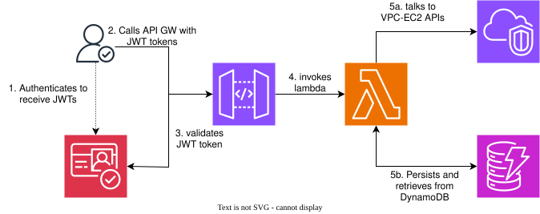

# vpc-manager-api
This serverless api creates, persists and retrieves AWS VPC and subnets focussing on serverless architecture.


## Introduction

- The idea is to build a serverless solution to interact with AWS VPC and related APIs to be able to provision, store and retrieve the VPC details.
- The following are the serverless services used:
  - AWS API gateway: Single entry point for API management.
  - AWS Lambda: Compute layer running core logic.
  - AWS Dynamodb: To persists VPC details.
  - AWS Cognito: To manage user authentication.
- Infrastructure provision is via Terraform.

### Architecture



### User Journey at a Glance

- User signs into cognito to retrieve a JWT token.
- User calls the API gateway HTTP API using this token as a Authorization Bearer token.
- API Gateway authenticates and authorizes the request by contacting AWS Cognito via the gateway authorizers.
- Upon successful authentication, API Gateway invokes/triggers the lambda function.
- Upon unsuccessful authentication, API Gateway never triggers the lambda function and returns a `401` unauthorized response.

## API Documentation

All API routes require a Cognito JWT access token:

```http
Authorization: Bearer <access-token>
```

The API URL is available from Terraform:

```bash
API_URL=$(terraform output -raw api_gateway_url)
```

### Create a VPC

```http
POST /vpcs
```

Request body:

```json
{
  "name": "my-vpc",
  "cidr_block": "10.0.0.0/16",
  "subnets": [
    {
      "name": "subnet-1",
      "cidr_block": "10.0.1.0/24",
      "az": "us-east-1a"
    },
    {
      "name": "subnet-2",
      "cidr_block": "10.0.2.0/24",
      "az": "us-east-1b"
    }
  ]
}
```

Example request:

```bash
curl -X POST "$API_URL/vpcs" \
  -H "Authorization: Bearer $ACCESS_TOKEN" \
  -H "Content-Type: application/json" \
  -d '{
    "name": "my-vpc",
    "cidr_block": "10.0.0.0/16",
    "subnets": [
      {"name": "subnet-1", "cidr_block": "10.0.1.0/24", "az": "us-east-1a"},
      {"name": "subnet-2", "cidr_block": "10.0.2.0/24", "az": "us-east-1b"}
    ]
  }'
```

Successful response: `201 Created`

```json
{
  "vpc_id": "vpc-0123456789abcdef0",
  "subnet_ids": [
    "subnet-0123456789abcdef0",
    "subnet-0123456789abcdef1"
  ]
}
```

### Retrieve a VPC

```http
GET /vpcs/{vpc_id}
```

Example request:

```bash
curl "$API_URL/vpcs/$VPC_ID" \
  -H "Authorization: Bearer $ACCESS_TOKEN"
```

Successful response: `200 OK`

```json
{
  "id": "vpc-0123456789abcdef0",
  "name": "my-vpc",
  "cidr_block": "10.0.0.0/16",
  "subnet_ids": [
    "subnet-0123456789abcdef0",
    "subnet-0123456789abcdef1"
  ],
  "created_at": "2026-09-18T12:00:00+00:00"
}
```

### Error responses

| Status | Meaning |
| --- | --- |
| `400` | Request body is missing required fields or has an invalid subnet list. |
| `401` | JWT is missing, invalid, or expired. API Gateway returns this response. |
| `404` | The requested VPC does not exist in DynamoDB. |
| `500` | An AWS operation failed while creating or retrieving the VPC. |

Unsupported methods and paths are rejected by API Gateway and do not invoke Lambda.
